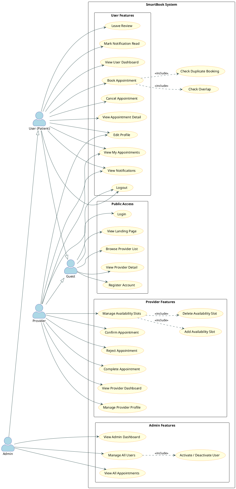
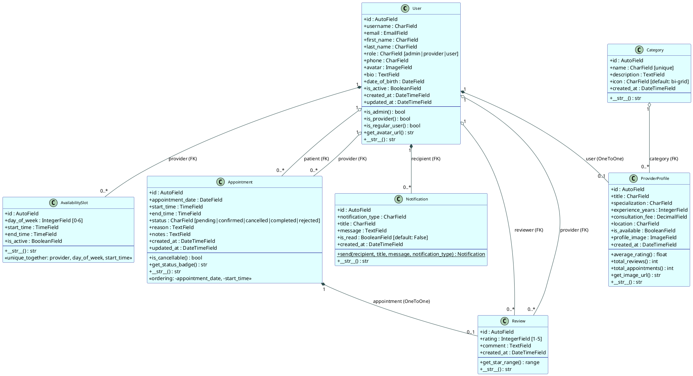
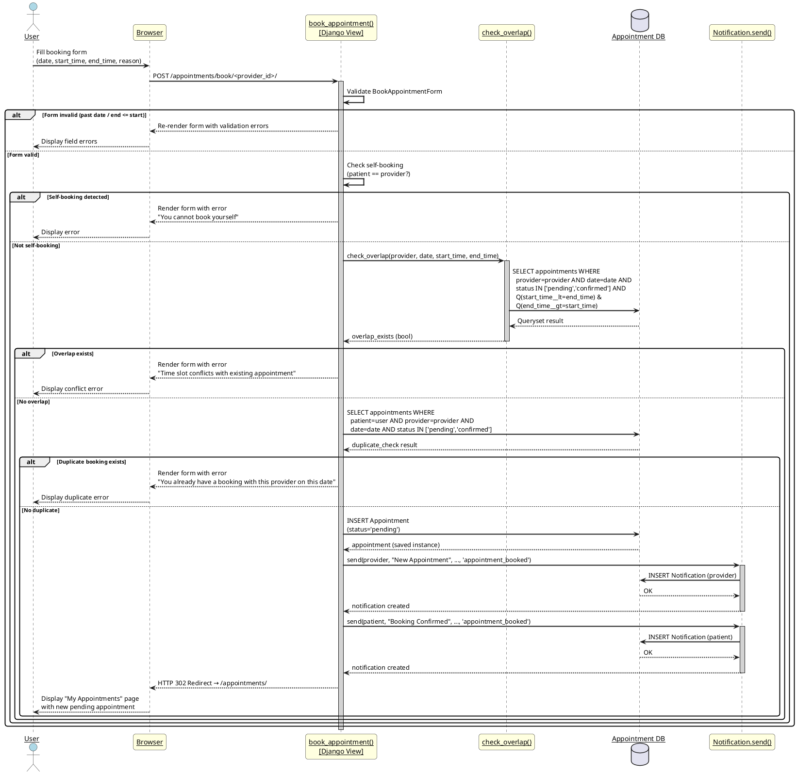
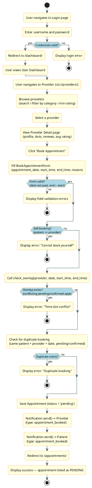
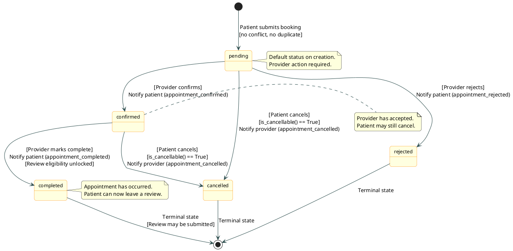
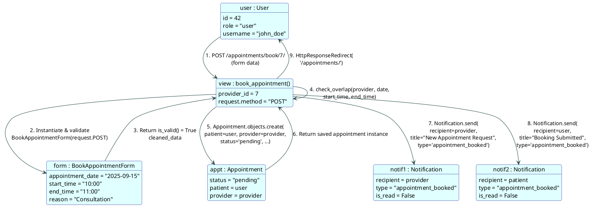
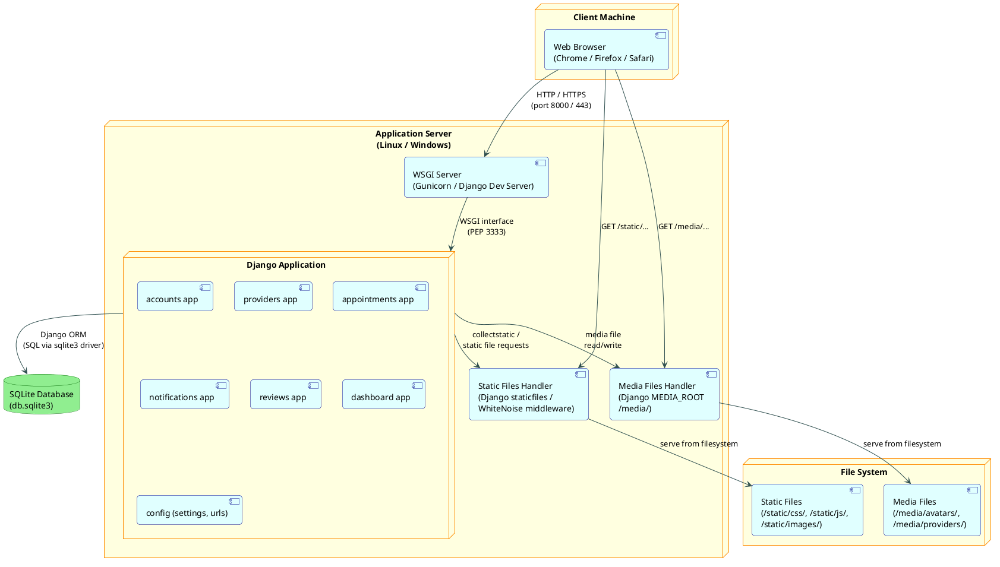

# SmartBook – Smart Appointment Booking System
## Complete Software Engineering Documentation

---

> **Project:** SmartBook – Smart Appointment Booking System  
> **Technology:** Django 6.0.5 Web Application  
> **Document Version:** 1.0  
> **Document Status:** Final  

---

## Table of Contents

1. [Project Overview](#1-project-overview)
2. [Software Requirements Specification (SRS)](#2-software-requirements-specification-srs)
3. [UML Diagrams](#3-uml-diagrams)
4. [ER Diagram](#4-er-diagram)
5. [Codebase Organization Summary](#5-codebase-organization-summary)
6. [Unit Testing & Test Summary](#6-unit-testing--test-summary)
7. [Agile / Scrum Artifacts](#7-agile--scrum-artifacts)

---

# 1. Project Overview

## 1.1 Introduction

SmartBook is a full-featured, web-based Smart Appointment Booking System built with the Django framework. It provides a centralized platform that connects service providers — such as doctors, consultants, therapists, and other professionals — with clients who need to schedule appointments. The system eliminates the inefficiencies of manual scheduling by automating the entire booking lifecycle: from provider discovery and slot availability management, through appointment confirmation and status tracking, to post-appointment reviews and notifications.

SmartBook is designed to serve three distinct user roles — administrators, service providers, and regular users (patients/clients) — each with a tailored dashboard and permission set. The application enforces business rules such as overlap detection, duplicate booking prevention, and role-based access control throughout every layer of the stack.

## 1.2 Objectives

1. **Streamline Appointment Scheduling** — Provide an intuitive, self-service booking interface that allows users to discover providers, view real-time availability, and book appointments without manual coordination.
2. **Enforce Conflict-Free Scheduling** — Implement robust server-side overlap detection to guarantee that no provider is double-booked for any given time window.
3. **Support Role-Based Access Control** — Distinguish between Admin, Provider, and User roles, granting each role precisely the permissions required for their responsibilities.
4. **Automate Notifications** — Deliver in-application notifications to all relevant parties at every significant appointment lifecycle event (booking, confirmation, cancellation, rejection, completion).
5. **Enable Provider Reputation Management** — Allow users to leave structured reviews and star ratings for completed appointments, giving providers a transparent reputation score.
6. **Provide Actionable Dashboards** — Offer role-specific dashboards with real-time statistics, upcoming appointment summaries, and quick-action controls to improve operational awareness.
7. **Facilitate Administrative Oversight** — Equip administrators with tools to manage all users, monitor all appointments system-wide, and activate or deactivate accounts.
8. **Deliver a Maintainable, Extensible Codebase** — Architect the system using Django's Model-View-Template (MVT) pattern with clearly separated Django applications, enabling future feature additions with minimal coupling.

## 1.3 Technologies Used

| Component | Technology | Version |
|-----------|-----------|---------|
| Web Framework | Django | 6.0.5 |
| REST API Support | Django REST Framework | 3.17.1 |
| Environment Management | python-dotenv | 1.2.2 |
| Image Processing | Pillow | 12.2.0 |
| Form Rendering | django-crispy-forms | 2.6 |
| Bootstrap 5 Form Pack | crispy-bootstrap5 | 2026.3 |
| Template Widget Utilities | django-widget-tweaks | 1.5.1 |
| Database | SQLite | 3.x (via Django ORM) |
| Frontend CSS Framework | Bootstrap | 5.x |
| Frontend Icons | Bootstrap Icons | Latest |
| Programming Language | Python | 3.10+ |
| Template Engine | Django Templates (Jinja-compatible) | Built-in |

## 1.4 System Architecture Overview

SmartBook follows Django's **Model-View-Template (MVT)** architectural pattern, which is a server-side MVC variant where:

- **Model** — Defines the data schema and business logic. Each Django application owns its models, which are mapped to SQLite database tables via Django's ORM.
- **View** — Contains the application logic (request handling, permission checks, queryset construction, form processing). Views are function-based (FBV) throughout this project.
- **Template** — HTML files rendered server-side using Django's template engine. Templates inherit from a shared `base.html` layout and use `crispy-forms` and `widget_tweaks` for form rendering.

The project is organized into **seven Django applications**, each with a single, well-defined responsibility:

```
config/          ← Project settings, root URL configuration, WSGI/ASGI entry points
accounts/        ← Custom User model, authentication (register/login/logout), profile management
providers/       ← Category, ProviderProfile, AvailabilitySlot models and views
appointments/    ← Appointment model, booking workflow, status management
notifications/   ← In-app notification model and delivery
reviews/         ← Review and rating model and views
dashboard/       ← Role-routed dashboards, landing page, admin management views
```

All inter-app communication occurs through Django's ORM (foreign key relationships) and direct Python imports — no message queue or microservice boundary exists in this version.

## 1.5 Key Features

- **Multi-role authentication** with custom User model (Admin / Provider / User)
- **Provider discovery** with full-text search, category filtering, and minimum rating filter
- **Real-time availability slot management** by providers (day-of-week based scheduling)
- **Conflict-aware appointment booking** with server-side overlap detection using Q objects
- **Complete appointment lifecycle management**: pending → confirmed → completed, with cancel and reject branches
- **Automated in-app notifications** triggered at every status transition
- **Star-rating review system** tied to completed appointments (one review per appointment)
- **Role-specific dashboards** with statistics, upcoming appointments, and quick actions
- **Admin user management** with activate/deactivate toggle
- **Responsive Bootstrap 5 UI** with Bootstrap Icons throughout
- **Media file handling** for user avatars and provider profile images via Pillow
- **REST Framework integration** for future API extensibility

## 1.6 Project Scope

### In-Scope

- User registration, login, logout, and profile management
- Provider profile creation and availability slot configuration
- Appointment booking with conflict detection and duplicate prevention
- Appointment status workflow (confirm, reject, cancel, complete)
- In-application notification system
- Review and rating submission for completed appointments
- Role-based dashboards (user, provider, admin)
- Admin user management (list, activate/deactivate)
- Admin appointment oversight (list all, filter by status)
- Public landing page with system statistics and featured providers
- Provider search and filter (name, specialization, category, rating)

### Out-of-Scope

- Email or SMS notification delivery (only in-app notifications are implemented)
- Payment processing or billing integration
- Video/telehealth consultation features
- Calendar integration (Google Calendar, Outlook, iCal export)
- Mobile native applications (iOS/Android)
- Multi-tenancy or white-label deployment
- Real-time WebSocket-based updates
- OAuth / social authentication (Google, Facebook login)
- Automated appointment reminders or scheduling
- Reporting and analytics exports (PDF/CSV)

---

# 2. Software Requirements Specification (SRS)

## 2.1 Introduction

### 2.1.1 Purpose

This Software Requirements Specification (SRS) document defines the complete functional and non-functional requirements for the SmartBook Smart Appointment Booking System. It serves as the authoritative reference for developers, testers, and stakeholders to understand what the system must do and the constraints under which it must operate.

### 2.1.2 Scope

This document covers the SmartBook web application in its entirety, including all seven Django applications: `accounts`, `providers`, `appointments`, `notifications`, `reviews`, `dashboard`, and `config`. It describes the system's behavior from the perspective of all three user roles (Admin, Provider, User) as well as unauthenticated guests.

### 2.1.3 Definitions, Acronyms, and Abbreviations

| Term | Definition |
|------|-----------|
| **SRS** | Software Requirements Specification |
| **MVT** | Model-View-Template — Django's architectural pattern |
| **ORM** | Object-Relational Mapper — Django's database abstraction layer |
| **FK** | Foreign Key — a relational database reference between tables |
| **RBAC** | Role-Based Access Control |
| **FBV** | Function-Based View — Django view style used throughout this project |
| **Provider** | A registered service professional who offers appointments |
| **Patient/User** | A registered end-user who books appointments with providers |
| **Admin** | A superuser with full system management privileges |
| **Slot** | An `AvailabilitySlot` record defining a provider's recurring weekly availability |
| **Overlap** | A scheduling conflict where two appointments share the same provider and overlapping time window |
| **Crispy Forms** | A Django library for rendering Bootstrap-styled forms |
| **Widget Tweaks** | A Django template library for customizing form field HTML attributes |

### 2.1.4 References

- Django 6.0.5 Official Documentation: https://docs.djangoproject.com/
- Django REST Framework 3.17.1 Documentation: https://www.django-rest-framework.org/
- Bootstrap 5 Documentation: https://getbootstrap.com/docs/5.0/
- Python PEP 8 Style Guide: https://peps.python.org/pep-0008/

---

## 2.2 Functional Requirements

### Authentication & Account Management

| ID | Requirement |
|----|------------|
| **FR-01** | The system shall allow any visitor to register a new account by providing a unique username, first name, last name, email address, phone number, role (user or provider), and password. |
| **FR-02** | The system shall validate that the username is unique and that the two password fields match during registration. |
| **FR-03** | The system shall authenticate registered users via username and password. Upon successful login, the user shall be redirected to `/dashboard/`. |
| **FR-04** | The system shall maintain authenticated sessions and restrict access to protected views for unauthenticated users, redirecting them to the login page. |
| **FR-05** | The system shall allow authenticated users to view and edit their profile, including first name, last name, email, phone, bio, date of birth, and avatar image. |
| **FR-06** | The system shall allow authenticated users to log out, destroying their session. |

### Provider Management

| ID | Requirement |
|----|------------|
| **FR-07** | The system shall allow users with the `provider` role to create and update their `ProviderProfile`, including category, title, specialization, years of experience, consultation fee, location, availability status, and profile image. |
| **FR-08** | The system shall allow providers to add `AvailabilitySlot` records specifying a day of the week (0–6), start time, and end time. The combination of provider, day of week, and start time must be unique. |
| **FR-09** | The system shall allow providers to delete their own availability slots. |
| **FR-10** | The system shall provide a public provider listing page that supports search by name, specialization, or title; filtering by category; and filtering by minimum average rating. |
| **FR-11** | The system shall provide a public provider detail page showing the provider's profile, availability slots, average rating, total reviews, and a list of reviews. |

### Appointment Booking & Lifecycle

| ID | Requirement |
|----|------------|
| **FR-12** | The system shall allow authenticated users with the `user` role to book an appointment with a provider by specifying an appointment date, start time, end time, and reason. |
| **FR-13** | The system shall prevent a user from booking an appointment with themselves (self-booking prevention). |
| **FR-14** | The system shall detect scheduling conflicts by querying all existing appointments for the target provider with status `pending` or `confirmed` where the existing appointment's start time is less than the requested end time AND the existing appointment's end time is greater than the requested start time. If a conflict is found, the booking shall be rejected with an error message. |
| **FR-15** | The system shall prevent duplicate bookings by rejecting a new appointment if the same patient already has a `pending` or `confirmed` appointment with the same provider on the same date. |
| **FR-16** | The system shall validate that the appointment date is not in the past and that the end time is strictly after the start time. |
| **FR-17** | Upon successful booking, the system shall create an `Appointment` record with status `pending` and send in-app notifications to both the provider and the patient. |
| **FR-18** | The system shall allow providers to confirm a `pending` appointment, transitioning its status to `confirmed` and notifying the patient. |
| **FR-19** | The system shall allow providers to reject a `pending` appointment, transitioning its status to `rejected` and notifying the patient. |
| **FR-20** | The system shall allow providers to mark a `confirmed` appointment as `completed`, transitioning its status to `completed` and notifying the patient. |
| **FR-21** | The system shall allow patients to cancel their own `pending` or `confirmed` appointments, transitioning the status to `cancelled` and notifying the provider. |
| **FR-22** | The system shall provide a role-aware appointment list view: providers see appointments where they are the provider; users see appointments where they are the patient. Both support filtering by status. |

### Notifications

| ID | Requirement |
|----|------------|
| **FR-23** | The system shall create `Notification` records for the following events: appointment booked, appointment confirmed, appointment cancelled, appointment rejected, appointment completed, and new review received. |
| **FR-24** | The system shall display all notifications for the authenticated user on a notifications page, marking all as read upon visit. |
| **FR-25** | The system shall provide an endpoint (`/notifications/unread-count/`) that returns the count of unread notifications as a JSON response, enabling real-time badge updates. |
| **FR-26** | The system shall allow users to mark individual notifications or all notifications as read. |

### Reviews

| ID | Requirement |
|----|------------|
| **FR-27** | The system shall allow a patient to leave exactly one review for a completed appointment. The review shall include a rating (integer 1–5) and an optional comment. |
| **FR-28** | The system shall prevent review submission for appointments that are not in `completed` status. |
| **FR-29** | The system shall prevent a second review for the same appointment (enforced by the `OneToOneField` between `Review` and `Appointment`). |
| **FR-30** | The system shall display all reviews for a provider on the provider's detail page and on a dedicated provider reviews page. |

### Dashboards & Administration

| ID | Requirement |
|----|------------|
| **FR-31** | The system shall route authenticated users to a role-appropriate dashboard: `admin_dashboard` for admins, `provider_dashboard` for providers, and `user_dashboard` for regular users. |
| **FR-32** | The user dashboard shall display upcoming appointments (date ≥ today, status in `pending`/`confirmed`), recent appointments, unread notifications, and statistics (total, upcoming, completed, cancelled counts). |
| **FR-33** | The provider dashboard shall display upcoming appointments, pending appointments requiring action, unread notifications, and statistics (total, pending, confirmed, completed counts, average rating, total reviews). |
| **FR-34** | The admin dashboard shall display system-wide statistics (total providers, total completed appointments, total users), recent appointments, and recent users. |
| **FR-35** | The system shall provide an admin-only user management view listing all users with role and search filters, and supporting an activate/deactivate toggle action. |
| **FR-36** | The system shall provide an admin-only appointment management view listing all appointments with status filter support. |
| **FR-37** | The public landing page shall display system statistics (total providers, total completed appointments, total users), featured providers, and available categories. |

---

## 2.3 Non-Functional Requirements

### Performance

| ID | Requirement |
|----|------------|
| **NFR-01** | All page responses shall be generated within 2 seconds under normal load (single-server, SQLite backend). |
| **NFR-02** | Database queries shall use Django ORM `select_related()` and `prefetch_related()` where appropriate to minimize N+1 query patterns on list views. |
| **NFR-03** | Static files (CSS, JS, images) shall be served efficiently and support browser caching via appropriate HTTP headers. |

### Security

| ID | Requirement |
|----|------------|
| **NFR-04** | All sensitive configuration values (SECRET_KEY, DEBUG flag, database credentials) shall be stored in environment variables loaded via `python-dotenv` and never committed to version control. |
| **NFR-05** | All forms shall include Django's CSRF token to prevent cross-site request forgery attacks. |
| **NFR-06** | All views that modify data shall require authentication via Django's `@login_required` decorator. |
| **NFR-07** | Role-based access control shall be enforced at the view layer; unauthorized access attempts shall result in an HTTP 403 response or redirect. |
| **NFR-08** | User passwords shall be stored as salted hashes using Django's default PBKDF2 password hasher. |
| **NFR-09** | File uploads (avatars, provider images) shall be restricted to image types via Pillow validation and stored in designated media directories. |

### Usability

| ID | Requirement |
|----|------------|
| **NFR-10** | The user interface shall be fully responsive, adapting to desktop, tablet, and mobile screen sizes using Bootstrap 5's grid system. |
| **NFR-11** | All forms shall display inline validation error messages adjacent to the relevant field. |
| **NFR-12** | Navigation shall clearly indicate the currently active section and display the user's unread notification count as a badge. |
| **NFR-13** | Status badges on appointments shall use consistent color coding (e.g., yellow for pending, green for confirmed/completed, red for cancelled/rejected). |

### Maintainability

| ID | Requirement |
|----|------------|
| **NFR-14** | The codebase shall be organized into discrete Django applications, each with a single, well-defined responsibility. |
| **NFR-15** | All models shall include `__str__` methods for human-readable representation in the Django admin interface. |
| **NFR-16** | Business logic (overlap detection, duplicate checking) shall be encapsulated in dedicated helper functions, not embedded in template code. |
| **NFR-17** | The project shall include a `requirements.txt` file with pinned dependency versions to ensure reproducible builds. |

### Reliability

| ID | Requirement |
|----|------------|
| **NFR-18** | The system shall use Django's ORM transaction handling to ensure that appointment creation and notification dispatch are atomic where possible. |
| **NFR-19** | The SQLite database file shall be excluded from version control via `.gitignore` to prevent data corruption from concurrent commits. |

---

## 2.4 System Features

### Feature 1: Role-Based Authentication System

The authentication system extends Django's built-in `AbstractUser` with a `role` field supporting three values: `admin`, `provider`, and `user`. Registration allows self-selection of the `user` or `provider` role. Admin accounts are created via Django's management commands. The `is_admin()`, `is_provider()`, and `is_regular_user()` helper methods on the User model enable clean role checks throughout the view layer.

### Feature 2: Provider Profile & Availability Management

Providers complete a secondary profile (`ProviderProfile`) linked via a `OneToOneField` to their user account. This profile captures professional details including category, specialization, consultation fee, and availability status. Providers define their weekly availability through `AvailabilitySlot` records, each specifying a day of the week and a time range. A unique constraint on `(provider, day_of_week, start_time)` prevents duplicate slot definitions.

### Feature 3: Conflict-Aware Appointment Booking

The booking workflow is the system's most critical feature. The `check_overlap()` function queries the database for any existing `pending` or `confirmed` appointment for the target provider on the requested date where the time windows intersect. The intersection condition uses Django's `Q` objects: `Q(start_time__lt=requested_end) & Q(end_time__gt=requested_start)`. This correctly handles all overlap cases including containment, partial overlap, and exact match.

### Feature 4: Appointment Lifecycle Management

Appointments progress through a defined state machine: `pending` → `confirmed` → `completed`. Alternative paths include `pending` → `rejected` and either `pending`/`confirmed` → `cancelled`. Each transition is restricted to the appropriate role (providers confirm/reject/complete; patients cancel) and triggers a notification to the other party.

### Feature 5: In-App Notification System

The `Notification.send()` class method provides a single, consistent interface for creating notification records throughout the application. Notifications carry a type, title, message, and read status. The unread count endpoint enables the navigation bar to display a live badge without a full page reload.

### Feature 6: Review & Rating System

Reviews are linked to appointments via a `OneToOneField`, enforcing the one-review-per-appointment constraint at the database level. The rating field uses integer validators (1–5) and is rendered as a radio select widget. The `ProviderProfile.average_rating()` method aggregates all reviews for a provider to produce a floating-point average displayed throughout the UI.

---

## 2.5 Constraints

1. **Database:** The system uses SQLite, which is suitable for development and low-concurrency production deployments but does not support high-concurrency write workloads. Migration to PostgreSQL would be required for production scale.
2. **Hosting:** The application is designed for single-server WSGI deployment (e.g., Gunicorn). Horizontal scaling would require a shared database backend and shared media storage.
3. **Notifications:** Only in-app notifications are supported. No email, SMS, or push notification delivery is implemented.
4. **File Storage:** Media files (avatars, provider images) are stored on the local filesystem. Cloud storage (e.g., AWS S3) is not configured.
5. **Authentication:** Only username/password authentication is supported. OAuth and social login are out of scope.
6. **Time Zones:** The system uses Django's default time zone handling. Multi-timezone support for geographically distributed providers is not implemented.

---

## 2.6 Assumptions

1. All users have access to a modern web browser with JavaScript enabled.
2. The deployment server has Python 3.10 or higher installed.
3. A single administrator manages the system and creates admin accounts via Django's management interface.
4. Providers are responsible for keeping their availability slots accurate and up to date.
5. The system operates in a single time zone consistent with the server's configured `TIME_ZONE` setting.
6. SQLite's write concurrency limitations are acceptable for the expected user load.
7. Media file storage on the local filesystem is sufficient for the deployment environment.

---

## 2.7 User Roles

### Admin

The Admin role has unrestricted access to all system functionality.

| Permission | Description |
|-----------|------------|
| View all users | Access the admin user management page listing every registered account |
| Activate/Deactivate users | Toggle the `is_active` flag on any user account |
| View all appointments | Access the admin appointment list with status filtering |
| Access Django admin panel | Full access to Django's built-in `/admin/` interface |
| View admin dashboard | System-wide statistics, recent appointments, recent users |
| All provider and user permissions | Admins inherit all lower-role capabilities |

### Provider

The Provider role manages their professional profile and appointment workflow.

| Permission | Description |
|-----------|------------|
| Create/edit ProviderProfile | Manage professional details, category, fee, availability status |
| Manage AvailabilitySlots | Add and delete weekly availability slot records |
| View own appointments | See all appointments where they are the provider |
| Confirm appointments | Transition a `pending` appointment to `confirmed` |
| Reject appointments | Transition a `pending` appointment to `rejected` |
| Complete appointments | Transition a `confirmed` appointment to `completed` |
| View provider dashboard | Upcoming appointments, pending actions, statistics |
| Receive notifications | Get notified of new bookings, cancellations |

### User (Patient/Client)

The User role interacts with providers and manages their own appointments.

| Permission | Description |
|-----------|------------|
| Browse providers | View the public provider list and individual provider profiles |
| Book appointments | Submit a booking request for any available provider |
| Cancel own appointments | Cancel their own `pending` or `confirmed` appointments |
| View own appointments | See all appointments where they are the patient |
| Leave reviews | Submit one review per completed appointment |
| View user dashboard | Upcoming appointments, recent history, notifications |
| Receive notifications | Get notified of confirmations, rejections, completions |
| Manage own profile | Edit personal details and avatar |

---

## 2.8 User Stories

| ID | Role | User Story | Priority |
|----|------|-----------|---------|
| US-01 | Guest | As a guest, I want to view the landing page with system statistics and featured providers so that I can understand what SmartBook offers before registering. | Medium |
| US-02 | Guest | As a guest, I want to register an account by choosing either the "user" or "provider" role so that I can access the appropriate features. | High |
| US-03 | Guest | As a guest, I want to browse the public provider list and filter by category or search by name so that I can find a suitable provider before logging in. | Medium |
| US-04 | User | As a user, I want to log in with my username and password so that I can access my personalized dashboard. | High |
| US-05 | User | As a user, I want to view my dashboard showing upcoming appointments and statistics so that I can quickly understand my schedule. | High |
| US-06 | User | As a user, I want to book an appointment with a provider by selecting a date, start time, end time, and providing a reason so that I can schedule a consultation. | High |
| US-07 | User | As a user, I want to be prevented from booking an appointment that conflicts with an existing booking so that I don't accidentally create scheduling conflicts. | High |
| US-08 | User | As a user, I want to cancel a pending or confirmed appointment so that I can free up the time slot if my plans change. | High |
| US-09 | User | As a user, I want to receive in-app notifications when my appointment is confirmed, rejected, or completed so that I stay informed without checking manually. | High |
| US-10 | User | As a user, I want to leave a star rating and comment for a completed appointment so that I can share my experience with other users. | Medium |
| US-11 | User | As a user, I want to edit my profile including uploading an avatar so that my account reflects my current information. | Medium |
| US-12 | Provider | As a provider, I want to create and update my professional profile including my specialization, consultation fee, and category so that patients can find and evaluate me. | High |
| US-13 | Provider | As a provider, I want to define my weekly availability by adding time slots for each day of the week so that patients know when I am available. | High |
| US-14 | Provider | As a provider, I want to confirm or reject pending appointment requests so that I have control over my schedule. | High |
| US-15 | Provider | As a provider, I want to mark a confirmed appointment as completed so that the patient becomes eligible to leave a review. | High |
| US-16 | Provider | As a provider, I want to view my dashboard showing pending appointments requiring action and upcoming confirmed appointments so that I can manage my day efficiently. | High |
| US-17 | Provider | As a provider, I want to receive notifications when a patient books or cancels an appointment so that I am always aware of schedule changes. | High |
| US-18 | Provider | As a provider, I want to see my average rating and total reviews on my dashboard so that I can monitor my reputation. | Medium |
| US-19 | Admin | As an admin, I want to view a list of all registered users with the ability to search and filter by role so that I can manage the user base. | High |
| US-20 | Admin | As an admin, I want to activate or deactivate any user account so that I can enforce platform policies. | High |
| US-21 | Admin | As an admin, I want to view all appointments across the system with status filtering so that I can monitor platform activity. | High |
| US-22 | Admin | As an admin, I want to see system-wide statistics on my dashboard so that I can assess overall platform health. | Medium |

---

## 2.9 Acceptance Criteria

### AC-01: User Registration

- Given a visitor submits the registration form with a unique username, valid email, matching passwords, and a selected role
- When the form is submitted
- Then a new User account is created, the user is logged in, and they are redirected to `/dashboard/`
- And if the username already exists, a validation error is displayed on the form

### AC-02: Appointment Booking — Conflict Detection

- Given an authenticated user submits a booking form for a provider
- When an existing `pending` or `confirmed` appointment for that provider on the same date has a time window that overlaps with the requested window
- Then the booking is rejected and an error message "This time slot conflicts with an existing appointment" (or equivalent) is displayed
- And no new Appointment record is created

### AC-03: Appointment Booking — Success

- Given an authenticated user submits a valid booking form with no conflicts and no duplicates
- When the form is submitted
- Then an Appointment record is created with status `pending`
- And a notification is sent to the provider with type `appointment_booked`
- And a notification is sent to the patient confirming the booking
- And the user is redirected to their appointments list

### AC-04: Appointment Confirmation

- Given a provider views a `pending` appointment detail page
- When the provider clicks "Confirm"
- Then the appointment status changes to `confirmed`
- And a notification is sent to the patient with type `appointment_confirmed`

### AC-05: Review Submission

- Given a patient has a `completed` appointment with no existing review
- When the patient submits the review form with a rating (1–5) and optional comment
- Then a Review record is created linked to the appointment
- And the provider's average rating is updated accordingly
- And if the patient attempts to submit a second review for the same appointment, they are redirected or shown an error

### AC-06: Notification Read Status

- Given a user navigates to `/notifications/`
- When the page loads
- Then all previously unread notifications for that user are marked as `is_read = True`
- And the unread badge count in the navigation bar updates to zero

### AC-07: Provider Search & Filter

- Given a visitor or user is on the provider list page
- When they enter a search term or select a category or set a minimum rating
- Then only providers matching all applied filters are displayed
- And if no providers match, an appropriate empty-state message is shown

---

---

# 3. UML Diagrams

> All diagrams are written in PlantUML syntax. Render them using the [PlantUML online server](https://www.plantuml.com/plantuml/uml/) or any compatible IDE plugin.

---

## 3.1 Use Case Diagram



---

## 3.2 Class Diagram



---

## 3.3 Sequence Diagram — Appointment Booking Flow



---

## 3.4 Activity Diagram — Full Booking Workflow



---

## 3.5 State Diagram — Appointment Lifecycle



---

## 3.6 Collaboration Diagram — Appointment Booking Object Interactions



---

## 3.7 Deployment Diagram



---

# 4. ER Diagram

The following Entity-Relationship diagram is expressed in [dbdiagram.io](https://dbdiagram.io) DBML format. Paste the code into dbdiagram.io to render the visual diagram.

```dbml
// SmartBook – Smart Appointment Booking System
// ER Diagram in DBML format (dbdiagram.io)

Table accounts_user {
  id          integer     [pk, increment, note: "Primary key"]
  username    varchar(150) [unique, not null, note: "Unique login identifier"]
  email       varchar(254) [not null, note: "User email address"]
  first_name  varchar(150) [not null]
  last_name   varchar(150) [not null]
  role        varchar(10)  [not null, note: "Choices: admin | provider | user"]
  phone       varchar(20)  [null, note: "Optional contact phone number"]
  avatar      varchar(255) [null, note: "ImageField — upload_to='avatars/'"]
  bio         text         [null, note: "Optional user biography"]
  date_of_birth date       [null]
  is_active   boolean      [not null, default: true, note: "Account active flag"]
  is_staff    boolean      [not null, default: false]
  is_superuser boolean     [not null, default: false]
  password    varchar(128) [not null, note: "Hashed password (PBKDF2)"]
  created_at  datetime     [not null, note: "Auto-set on creation"]
  updated_at  datetime     [not null, note: "Auto-updated on save"]
}

Table providers_category {
  id          integer     [pk, increment]
  name        varchar(100) [unique, not null, note: "Category display name"]
  description text         [null]
  icon        varchar(50)  [not null, default: "bi-grid", note: "Bootstrap Icon class"]
  created_at  datetime     [not null]
}

Table providers_providerprofile {
  id                integer     [pk, increment]
  user_id           integer     [not null, unique, ref: - accounts_user.id, note: "OneToOne → User"]
  category_id       integer     [null, ref: > providers_category.id, note: "FK → Category"]
  title             varchar(100) [null, note: "e.g. Dr., Prof., Mr."]
  specialization    varchar(200) [null]
  experience_years  integer      [null, note: "Years of professional experience"]
  consultation_fee  decimal(10,2) [null, note: "Fee per appointment in local currency"]
  location          varchar(200) [null]
  is_available      boolean      [not null, default: true, note: "Provider accepting bookings"]
  profile_image     varchar(255) [null, note: "ImageField — upload_to='providers/'"]
  created_at        datetime     [not null]
}

Table providers_availabilityslot {
  id           integer  [pk, increment]
  provider_id  integer  [not null, ref: > accounts_user.id, note: "FK → User (provider role)"]
  day_of_week  integer  [not null, note: "0=Monday … 6=Sunday"]
  start_time   time     [not null]
  end_time     time     [not null]
  is_active    boolean  [not null, default: true]

  indexes {
    (provider_id, day_of_week, start_time) [unique, name: "unique_provider_day_start"]
  }
}

Table appointments_appointment {
  id               integer     [pk, increment]
  patient_id       integer     [not null, ref: > accounts_user.id, note: "FK → User (patient)"]
  provider_id      integer     [not null, ref: > accounts_user.id, note: "FK → User (provider)"]
  appointment_date date        [not null]
  start_time       time        [not null]
  end_time         time        [not null]
  status           varchar(20) [not null, default: "pending", note: "pending|confirmed|cancelled|completed|rejected"]
  reason           text        [null, note: "Patient-provided reason for appointment"]
  notes            text        [null, note: "Provider notes (optional)"]
  created_at       datetime    [not null]
  updated_at       datetime    [not null]
}

Table notifications_notification {
  id                integer     [pk, increment]
  recipient_id      integer     [not null, ref: > accounts_user.id, note: "FK → User"]
  notification_type varchar(30) [not null, note: "appointment_booked|confirmed|cancelled|rejected|completed|new_review|general"]
  title             varchar(200) [not null]
  message           text         [not null]
  is_read           boolean      [not null, default: false]
  created_at        datetime     [not null]
}

Table reviews_review {
  id             integer  [pk, increment]
  appointment_id integer  [not null, unique, ref: - appointments_appointment.id, note: "OneToOne → Appointment"]
  reviewer_id    integer  [not null, ref: > accounts_user.id, note: "FK → User (patient who reviewed)"]
  provider_id    integer  [not null, ref: > accounts_user.id, note: "FK → User (provider being reviewed)"]
  rating         integer  [not null, note: "Integer 1–5 (validated by MinValueValidator/MaxValueValidator)"]
  comment        text     [null]
  created_at     datetime [not null]
}
```

### Cardinality Summary

| Relationship | Cardinality | Description |
|-------------|------------|-------------|
| `accounts_user` → `providers_providerprofile` | 1 : 0..1 | Each user may have at most one provider profile (OneToOne) |
| `providers_category` → `providers_providerprofile` | 1 : 0..* | A category can have many provider profiles |
| `accounts_user` → `providers_availabilityslot` | 1 : 0..* | A provider user can define many availability slots |
| `accounts_user` (patient) → `appointments_appointment` | 1 : 0..* | A user can have many appointments as patient |
| `accounts_user` (provider) → `appointments_appointment` | 1 : 0..* | A provider user can have many appointments |
| `appointments_appointment` → `reviews_review` | 1 : 0..1 | Each appointment may have at most one review (OneToOne) |
| `accounts_user` → `notifications_notification` | 1 : 0..* | A user can receive many notifications |
| `accounts_user` (reviewer) → `reviews_review` | 1 : 0..* | A user can write many reviews |
| `accounts_user` (provider) → `reviews_review` | 1 : 0..* | A provider can receive many reviews |

---

# 5. Codebase Organization Summary

## 5.1 Full Folder Structure

```
appointment system/                  ← Project root
│
├── config/                          ← Django project configuration package
│   ├── __init__.py
│   ├── settings.py                  ← All Django settings (installed apps, DB, auth, media, static)
│   ├── urls.py                      ← Root URL configuration (includes all app URL namespaces)
│   ├── wsgi.py                      ← WSGI entry point for production deployment
│   └── asgi.py                      ← ASGI entry point (async support)
│
├── accounts/                        ← Custom user model and authentication
│   ├── models.py                    ← User (extends AbstractUser) with role, phone, avatar, bio
│   ├── views.py                     ← register_view, login_view, logout_view, profile_view, profile_edit_view
│   ├── forms.py                     ← RegisterForm, LoginForm, ProfileUpdateForm
│   ├── urls.py                      ← URL patterns for accounts namespace
│   ├── admin.py                     ← UserAdmin registration
│   ├── apps.py                      ← AccountsConfig
│   ├── tests.py                     ← Account-related test cases
│   └── migrations/                  ← Database migration files
│       └── 0001_initial.py
│
├── providers/                       ← Provider profiles, categories, availability
│   ├── models.py                    ← Category, ProviderProfile, AvailabilitySlot
│   ├── views.py                     ← provider_list, provider_detail, manage_profile, manage_slots, delete_slot
│   ├── forms.py                     ← ProviderProfileForm, AvailabilitySlotForm
│   ├── urls.py                      ← URL patterns for providers namespace
│   ├── admin.py                     ← Category, ProviderProfile, AvailabilitySlot admin registration
│   ├── apps.py                      ← ProvidersConfig
│   ├── tests.py                     ← Provider-related test cases
│   └── migrations/
│       └── 0001_initial.py
│
├── appointments/                    ← Appointment booking and lifecycle management
│   ├── models.py                    ← Appointment model with status workflow
│   ├── views.py                     ← book_appointment, my_appointments, appointment_detail,
│   │                                   cancel_appointment, confirm_appointment,
│   │                                   reject_appointment, complete_appointment, check_overlap()
│   ├── forms.py                     ← BookAppointmentForm
│   ├── urls.py                      ← URL patterns for appointments namespace
│   ├── admin.py                     ← Appointment admin registration
│   ├── apps.py                      ← AppointmentsConfig
│   ├── tests.py                     ← Appointment-related test cases
│   └── migrations/
│       └── 0001_initial.py
│
├── notifications/                   ← In-app notification system
│   ├── models.py                    ← Notification model with send() class method
│   ├── views.py                     ← notification_list, mark_read, mark_all_read, unread_count
│   ├── urls.py                      ← URL patterns for notifications namespace
│   ├── admin.py                     ← Notification admin registration
│   ├── apps.py                      ← NotificationsConfig
│   ├── tests.py                     ← Notification-related test cases
│   └── migrations/
│       └── 0001_initial.py
│
├── reviews/                         ← Review and rating system
│   ├── models.py                    ← Review model (OneToOne → Appointment)
│   ├── views.py                     ← leave_review, provider_reviews
│   ├── forms.py                     ← ReviewForm (rating RadioSelect, comment)
│   ├── urls.py                      ← URL patterns for reviews namespace
│   ├── admin.py                     ← Review admin registration
│   ├── apps.py                      ← ReviewsConfig
│   ├── tests.py                     ← Review-related test cases
│   └── migrations/
│       └── 0001_initial.py
│
├── dashboard/                       ← Dashboards and admin management views
│   ├── models.py                    ← (No models — dashboard is view-only)
│   ├── views.py                     ← landing_page, home (router), user_dashboard,
│   │                                   provider_dashboard, admin_dashboard,
│   │                                   admin_users, admin_appointments
│   ├── urls.py                      ← URL patterns for dashboard namespace
│   ├── admin.py                     ← (Empty)
│   ├── apps.py                      ← DashboardConfig
│   ├── tests.py                     ← Dashboard-related test cases
│   └── migrations/
│       └── __init__.py
│
├── templates/                       ← All HTML templates (server-side rendered)
│   ├── base.html                    ← Master layout: navbar, sidebar, notification badge, footer
│   ├── accounts/
│   │   ├── register.html            ← Registration form page
│   │   ├── login.html               ← Login form page
│   │   ├── profile.html             ← User profile view page
│   │   └── profile_edit.html        ← Profile edit form page
│   ├── appointments/
│   │   ├── book.html                ← Appointment booking form
│   │   ├── my_appointments.html     ← Appointment list (role-aware)
│   │   ├── detail.html              ← Appointment detail with action buttons
│   │   ├── cancel_confirm.html      ← Cancellation confirmation page
│   │   ├── confirm.html             ← Provider confirm confirmation page
│   │   ├── complete.html            ← Provider complete confirmation page
│   │   └── reject.html              ← Provider reject confirmation page
│   ├── providers/
│   │   ├── list.html                ← Provider search/filter listing
│   │   ├── detail.html              ← Provider profile, slots, reviews
│   │   ├── manage_profile.html      ← Provider profile edit form
│   │   └── manage_slots.html        ← Availability slot management
│   ├── dashboard/
│   │   ├── landing.html             ← Public landing page with stats
│   │   ├── user_dashboard.html      ← User role dashboard
│   │   ├── provider_dashboard.html  ← Provider role dashboard
│   │   ├── admin_dashboard.html     ← Admin role dashboard
│   │   ├── admin_users.html         ← Admin user management list
│   │   └── admin_appointments.html  ← Admin appointment list
│   ├── notifications/
│   │   └── list.html                ← Notification inbox
│   └── reviews/
│       ├── leave_review.html        ← Review submission form
│       └── provider_reviews.html    ← All reviews for a provider
│
├── static/                          ← Static assets (CSS, JS, images)
│   ├── css/
│   │   └── main.css                 ← Custom stylesheet (Bootstrap 5 overrides, custom components)
│   ├── js/
│   │   └── main.js                  ← Custom JavaScript (notification badge polling, UI enhancements)
│   └── images/
│       ├── default-avatar.png       ← Fallback avatar image
│       ├── default-avatar.svg       ← SVG fallback avatar
│       ├── default-provider.png     ← Fallback provider profile image
│       └── default-provider.svg     ← SVG fallback provider image
│
├── media/                           ← User-uploaded files (excluded from version control)
│   ├── avatars/                     ← User avatar uploads (upload_to='avatars/')
│   └── providers/                   ← Provider profile image uploads
│
├── manage.py                        ← Django management command entry point
├── requirements.txt                 ← Pinned Python dependencies
├── .env                             ← Environment variables (SECRET_KEY, DEBUG — not in VCS)
├── .env.example                     ← Template for environment variable configuration
├── db.sqlite3                       ← SQLite database file (excluded from VCS)
├── seed_data.py                     ← Script for populating development data
├── setup.bat                        ← Windows setup script (venv creation, migrations, seed)
└── README.md                        ← Project quick-start guide
```

---

## 5.2 Django Application Responsibilities

| App | Responsibility |
|-----|---------------|
| `config` | Project-level settings, root URL routing, WSGI/ASGI configuration. Acts as the entry point and glue for all other apps. |
| `accounts` | Custom User model extending `AbstractUser`. Handles registration, login, logout, profile view, and profile editing. Defines the `role` field that drives RBAC throughout the system. |
| `providers` | Manages the `Category`, `ProviderProfile`, and `AvailabilitySlot` models. Provides public provider discovery views and provider-only profile/slot management views. |
| `appointments` | Core booking engine. Contains the `Appointment` model, the `check_overlap()` conflict detection function, and all appointment lifecycle views (book, confirm, reject, complete, cancel). |
| `notifications` | Lightweight in-app notification system. The `Notification.send()` class method is called from other apps to create notification records. Provides views for listing, reading, and counting notifications. |
| `reviews` | Manages the `Review` model (OneToOne with Appointment). Enforces the one-review-per-completed-appointment business rule. Provides review submission and provider review listing views. |
| `dashboard` | Aggregates data from all other apps to render role-specific dashboards. Contains no models of its own. Also provides the public landing page and admin management views (user list, appointment list). |

---

## 5.3 URL Routing Structure

### Root URL Configuration (`config/urls.py`)

| URL Prefix | Included URLconf | Namespace |
|-----------|-----------------|-----------|
| `/` | `dashboard.urls` | `dashboard` |
| `/accounts/` | `accounts.urls` | `accounts` |
| `/appointments/` | `appointments.urls` | `appointments` |
| `/providers/` | `providers.urls` | `providers` |
| `/notifications/` | `notifications.urls` | `notifications` |
| `/reviews/` | `reviews.urls` | `reviews` |
| `/admin/` | `django.contrib.admin.site.urls` | — |

### Complete URL Pattern Reference

| URL Pattern | View | Name | Access |
|------------|------|------|--------|
| `/` | `landing_page` | `dashboard:landing` | Public |
| `/dashboard/` | `home` (role router) | `dashboard:home` | Authenticated |
| `/accounts/register/` | `register_view` | `accounts:register` | Guest only |
| `/accounts/login/` | `login_view` | `accounts:login` | Guest only |
| `/accounts/logout/` | `logout_view` | `accounts:logout` | Authenticated |
| `/accounts/profile/` | `profile_view` | `accounts:profile` | Authenticated |
| `/accounts/profile/edit/` | `profile_edit_view` | `accounts:profile_edit` | Authenticated |
| `/appointments/` | `my_appointments` | `appointments:my_appointments` | Authenticated |
| `/appointments/book/<provider_id>/` | `book_appointment` | `appointments:book` | User role |
| `/appointments/<pk>/` | `appointment_detail` | `appointments:detail` | Authenticated |
| `/appointments/<pk>/cancel/` | `cancel_appointment` | `appointments:cancel` | Authenticated |
| `/appointments/<pk>/confirm/` | `confirm_appointment` | `appointments:confirm` | Provider role |
| `/appointments/<pk>/reject/` | `reject_appointment` | `appointments:reject` | Provider role |
| `/appointments/<pk>/complete/` | `complete_appointment` | `appointments:complete` | Provider role |
| `/providers/` | `provider_list` | `providers:list` | Public |
| `/providers/<pk>/` | `provider_detail` | `providers:detail` | Public |
| `/providers/manage/profile/` | `manage_profile` | `providers:manage_profile` | Provider role |
| `/providers/manage/slots/` | `manage_slots` | `providers:manage_slots` | Provider role |
| `/providers/manage/slots/<pk>/delete/` | `delete_slot` | `providers:delete_slot` | Provider role |
| `/notifications/` | `notification_list` | `notifications:list` | Authenticated |
| `/notifications/<pk>/read/` | `mark_read` | `notifications:mark_read` | Authenticated |
| `/notifications/mark-all-read/` | `mark_all_read` | `notifications:mark_all_read` | Authenticated |
| `/notifications/unread-count/` | `unread_count` | `notifications:unread_count` | Authenticated |
| `/reviews/appointment/<appointment_id>/review/` | `leave_review` | `reviews:leave_review` | Authenticated |
| `/reviews/provider/<provider_id>/` | `provider_reviews` | `reviews:provider_reviews` | Public |

---

## 5.4 Key Settings (`config/settings.py`)

| Setting | Value | Purpose |
|---------|-------|---------|
| `AUTH_USER_MODEL` | `'accounts.User'` | Replaces Django's default User with the custom model |
| `LOGIN_REDIRECT_URL` | `'/dashboard/'` | Post-login redirect destination |
| `LOGIN_URL` | `'/accounts/login/'` | Redirect target for `@login_required` |
| `CRISPY_TEMPLATE_PACK` | `'bootstrap5'` | Crispy forms renders Bootstrap 5 styled forms |
| `MEDIA_URL` | `'/media/'` | URL prefix for user-uploaded files |
| `MEDIA_ROOT` | `BASE_DIR / 'media'` | Filesystem path for media file storage |
| `STATIC_URL` | `'/static/'` | URL prefix for static assets |
| `REST_FRAMEWORK` | `SessionAuthentication`, `IsAuthenticated` | DRF default authentication and permission classes |
| `DATABASES` | SQLite (`db.sqlite3`) | Development database backend |

---

## 5.5 Reusable Components

### Base Template (`templates/base.html`)

All application templates extend `base.html`, which provides:
- Bootstrap 5 CSS and JS CDN links
- Bootstrap Icons CDN link
- Responsive navigation bar with role-aware menu items
- Unread notification badge (populated via AJAX call to `/notifications/unread-count/`)
- Flash message display block (Django messages framework)
- Main content block (``)
- Footer

### Crispy Forms

All forms use `` and render with `{{ form|crispy }}` or ``. This automatically applies Bootstrap 5 form control classes, labels, and error styling without manual HTML.

### Widget Tweaks

`django-widget-tweaks` is used in templates where fine-grained control over individual form field attributes is needed (e.g., adding custom CSS classes, placeholder text, or `data-*` attributes to specific inputs) without modifying the Python form class.

---
